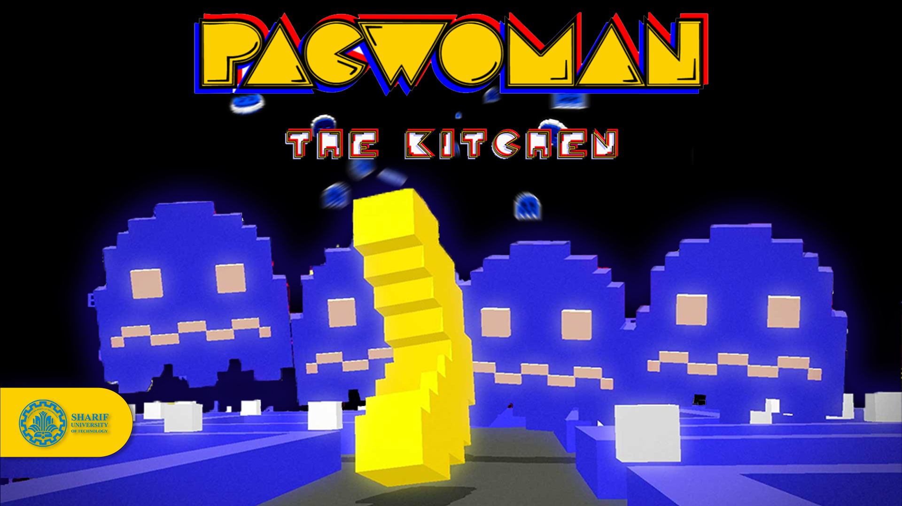
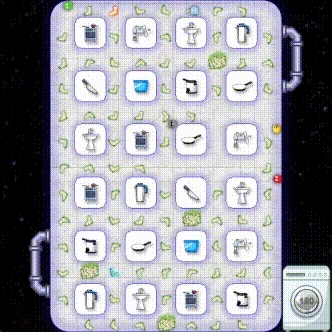
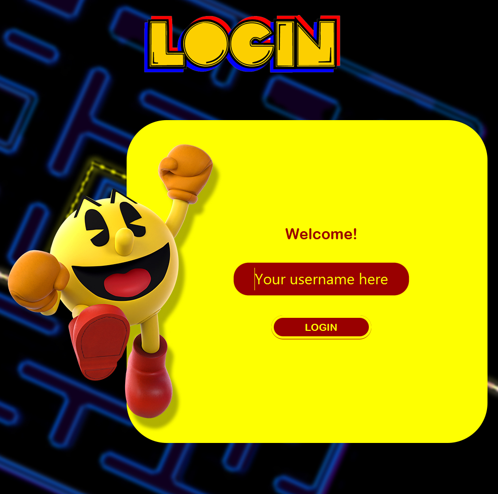
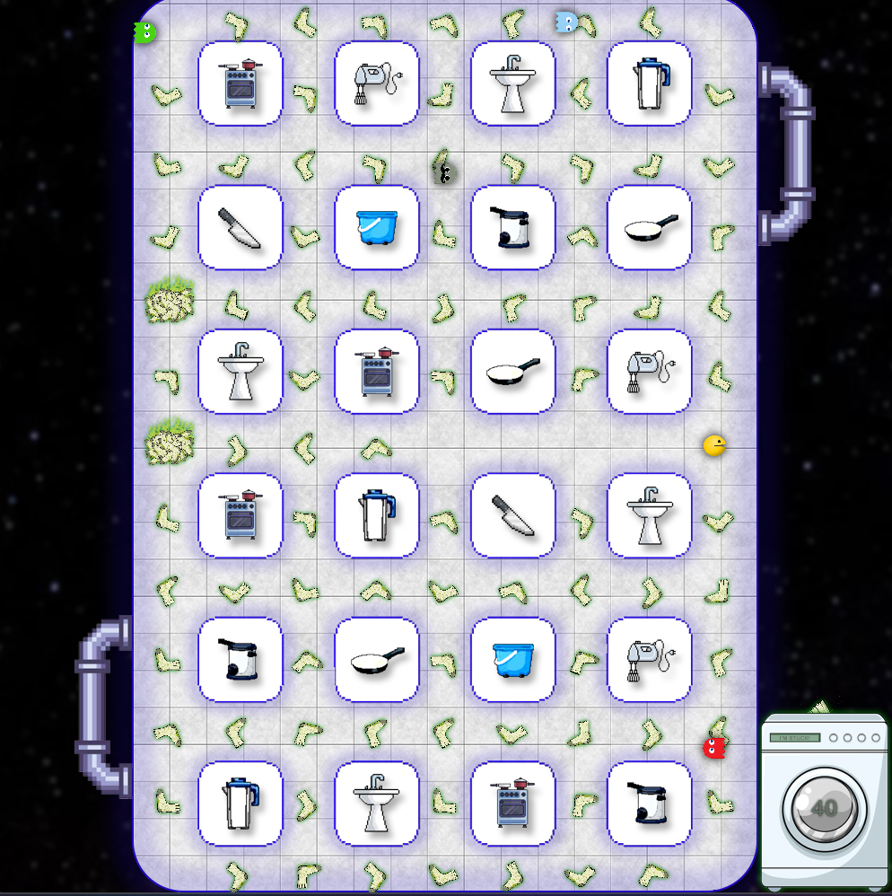

# PacWoman .:The Kitchen:.

>  ***Department of Electrical Engineering, Sharif University of Technology***

<h2 align="left">TABLE OF CONTENTS</h2>

- [GAME PREVIEW](#game-preview)
- [PROJECT DESCRIPTION](#project-description)
    - [GHOSTS MOVEMENT](#ghosts-movement)
- [CREDITS](#credits)
- [GAME SNAPSHOTS](#game-snapshots)

<a href="#game-preview">
<h2 align=CENTER>GAME PREVIEW</h2>
</a>

<a href="#project-description">
<h2>  Project Description </h2>
</a>

In this project, we are trying to make our own version of the nostalgic retro game **PacMan** using the power of **Object Oriented Programming** and **Java** as one of the most frequently used Object Oriented Programming languages.

As for the graphics, we will use **JavaFX** as a software platform designed to deliver desktop applications.

Data is also handled using a local database accessed by **SQLite3** (Structured Query Language).

Ghosts movements are designed using **Path Finding Algorithms** to find the shortest path to the player.

> The *Grey* ghost finds the shortest path to the PacMan and follows it. The *Yellow* and *Red* ghosts get close to the PacMan (within a particular radius) and then perform random movements. The *Green* ghost moves completely randomly.

<a href="#credits">
<h2>  Credits</h2>
</a>

| Name | School | Student ID |
| --- | --- | --- |
| Amirreza Mirjalily | Sharif University of Technology | 402102549 |

<a href="#game-snapshots">
<h2>   Game Snapshots</h2>
</a>

